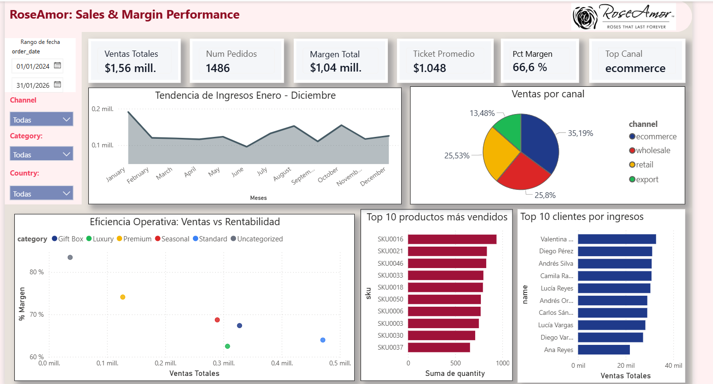

# Ingeniería de Datos y Analytics - Proyecto RoseAmor

Este repositorio contiene la solución técnica desarrollada para RoseAmor, enfocada en la transformación de datos operativos de ventas en información estratégica. El sistema integra un pipeline ETL automatizado, un repositorio de datos relacional, un dashboard ejecutivo en Power BI y una herramienta web para la gestión de operaciones en tiempo real.

## Componentes del Sistema

- **Pipeline ETL**: Motor de transformación en Python diseñado para la limpieza, validación y canonización de datos.
- **Data Warehouse Relacional**: Implementación en SQLite con integridad referencial y vistas optimizadas para reporting.
- **Dashboard Ejecutivo**: Sistema de visualización interactivo en Power BI para el monitoreo de KPIs críticos.
- **Portal Operativo**: Interfaz web desarrollada en Flask para el registro de transacciones y visualización de métricas en vivo.

## Arquitectura de la Solución

El flujo de datos sigue un modelo de capas para garantizar la trazabilidad:

1. **Capa Raw**: Almacenamiento inmutable de los archivos fuente (CSV). Los archivos originales nunca se modifican ni se eliminan.
2. **Capa de Procesamiento**: Scripts de Python que aplican reglas de negocio, corrección de tipos, deduplicación e imputación de valores faltantes. El resultado se exporta como CSVs limpios en `data/processed/`.
3. **Capa de Consumo**: Base de datos SQLite con tablas relacionales y una vista enriquecida (`v_orders_enriched`) que combina las 3 tablas con campos calculados como `revenue` y `margin`, lista para el consumo directo por Power BI y la aplicación web.

---

## Limpieza de Datos: Que se hizo y por que

El pipeline ETL ejecuta un perfilado automatizado sobre los 3 archivos CSV fuente antes de aplicar cualquier transformación. A continuación se detalla cada hallazgo, la decisión tomada y la justificación técnica.

### Tabla `customers.csv`

| Hallazgo | Filas afectadas | Accion aplicada | Justificacion |
|----------|-----------------|-----------------|---------------|
| Campo `country` con valores nulos | 8 registros | Se rellenaron con el valor `Unknown` | No se eliminaron porque un cliente sin pais registrado sigue siendo un cliente valido con historial de compras. Eliminar esas filas significaria perder todas sus ordenes asociadas. Se opto por `Unknown` en lugar de un pais arbitrario para mantener la honestidad del dato y permitir su correccion futura. |
| Campo `segment` con valores nulos | 4 registros | Se rellenaron con el valor `Unknown` | Misma logica que el caso anterior. La segmentacion comercial es un dato complementario; su ausencia no invalida la transaccion del cliente. |
| Registros duplicados por `customer_id` | Verificados | Se conservo la primera ocurrencia | La clave primaria `customer_id` debe ser unica. En caso de duplicados, se asume que el primer registro es el original y los posteriores son errores de carga. |

### Tabla `products.csv`

| Hallazgo | Filas afectadas | Accion aplicada | Justificacion |
|----------|-----------------|-----------------|---------------|
| Costos negativos (ej: -6.94) | 3 productos | Se convirtieron a valor absoluto con `abs()` | Un costo de produccion negativo no tiene sentido contable. Se interpreto como un error de signo en la fuente de datos. En un entorno productivo, estos registros se devolverian al equipo responsable para su correccion, pero para esta prueba se aplico la correccion automatica porque el valor absoluto es coherente con el rango de costos del resto del catalogo. |
| Campo `category` con valores nulos | 2 productos | Se rellenaron con `Uncategorized` | No se eliminaron porque un producto sin categoria sigue siendo un producto vendible con ordenes asociadas. Eliminarlo romperia la integridad referencial de la tabla `orders`. |
| Productos inactivos (`active = False`) | 11 productos | Se mantuvieron en la base de datos | No se eliminaron porque tienen historial de ventas. Si se borran de la tabla `products`, las ordenes que los referencian quedarian huerfanas. En su lugar, se filtran dinamicamente en la interfaz web (solo se muestran productos con `active = 1` en los formularios). |

### Tabla `orders.csv`

| Hallazgo | Filas afectadas | Accion aplicada | Justificacion |
|----------|-----------------|-----------------|---------------|
| Registros con `order_id` duplicado | ~14 filas | Se conservo la primera ocurrencia y se eliminaron las demas | El `order_id` es la clave primaria de la tabla de hechos. Un pedido duplicado distorsiona las metricas de ventas (se contaria dos veces el ingreso). Se conserva el primero asumiendo que es el registro original. |
| Fechas invalidas (ej: `2025-13-40`) | ~5 filas | Se eliminaron | Una fecha con mes 13 o dia 40 no existe en el calendario. No hay forma segura de inferir la fecha correcta sin informacion adicional. Conservar estos registros con una fecha arbitraria introduciria datos falsos en el analisis temporal. Por eso se eliminan completamente. |
| Cantidades negativas (`quantity < 0`) | ~8 filas | Se eliminaron del analisis de ventas | Una cantidad negativa podria representar una devolucion o un ajuste de inventario. Sin embargo, el modelo actual no contempla una tabla de devoluciones separada. Incluir cantidades negativas en el calculo de ventas totales reduciria el ingreso real de forma incorrecta, ya que no se tiene informacion complementaria (como motivo de devolucion o nota de credito). En un modelo mas robusto, se crearian tablas separadas `sales` y `returns`. |
| Campo `unit_price` con valores nulos | ~10 filas | Se imputaron con el precio promedio historico del mismo SKU | No se eliminaron porque la orden en si es valida (tiene cliente, producto, cantidad y fecha). Eliminar una orden completa por falta de precio seria una perdida de informacion innecesaria. Se utilizo el promedio del mismo SKU porque es la estimacion mas precisa disponible. Si el SKU tampoco tenia historial, se uso el promedio global como ultimo recurso. |
| Campo `channel` con variaciones de formato | Todas las filas | Se normalizo a minusculas con `str.lower().strip()` | Evita que `Ecommerce`, `ecommerce` y ` ecommerce ` se traten como canales distintos en los reportes. |

---

## Modelo de Datos para Reportes

Se implemento un esquema relacional de tipo estrella simplificado, optimizado para consultas analiticas:

```
customers (Dimension)          orders (Tabla de Hechos)          products (Dimension)
+--------------+               +----------------+                +-----------+
| customer_id  | PK   1:N      | order_id       | PK             | sku       | PK
| name         |-------->------| customer_id    | FK             | category  |
| country      |               | sku            | FK------<------| cost      |
| segment      |               | quantity       | CHECK > 0      | active    |
| created_at   |               | unit_price     | CHECK > 0      +-----------+
+--------------+               | order_date     |
                               | channel        |
                               +----------------+
```

La tabla `orders` actua como tabla de hechos central, conectada a dos tablas de dimension (`customers` y `products`) mediante claves foraneas. Esto permite:

- Calcular metricas derivadas como `revenue` (quantity * unit_price) y `margin` (quantity * (unit_price - cost)) mediante JOINs.
- Filtrar y segmentar por cualquier atributo dimensional (pais, segmento, categoria, canal) sin duplicar datos.
- Mantener la integridad referencial: no se puede registrar una orden con un cliente o producto inexistente.

Adicionalmente, se creo la vista `v_orders_enriched` que pre-calcula los campos `revenue` y `margin` para simplificar las consultas del dashboard y la capa web.

---

## Actualizacion con Nuevos Datos

Si manana llega un archivo CSV nuevo con datos adicionales, el proceso de actualizacion es directo:

### Procedimiento

1. Colocar los nuevos archivos CSV en la carpeta `data/raw/`, reemplazando los anteriores.
2. Ejecutar el pipeline ETL:
   ```powershell
   python etl/etl_pipeline.py
   ```
3. Abrir el dashboard en Power BI Desktop y presionar el boton "Actualizar".

### Que sucede internamente

- El pipeline primero **archiva** los CSV actuales en `data/archive/` con una marca de tiempo, preservando un historial completo de todas las versiones procesadas.
- Luego **lee los nuevos archivos sin modificarlos** (principio de inmutabilidad de la capa Raw).
- Aplica todas las reglas de limpieza documentadas anteriormente sobre copias en memoria.
- **Elimina la base de datos anterior y la recrea desde cero** (ejecucion idempotente). Esto garantiza que no existan residuos de cargas anteriores ni registros huerfanos.
- Exporta los datos limpios como CSV en `data/processed/` para consumo directo de Power BI.
- Genera un archivo de log detallado en `data/logs/` con el resultado de cada paso para auditoria.

### Escalabilidad a produccion

En un entorno empresarial real, este proceso manual se reemplazaria por:

- Un orquestador como Apache Airflow que detecte automaticamente la llegada de nuevos archivos.
- Transformaciones versionadas con dbt para mantener trazabilidad de cambios en las reglas de negocio.
- Un data warehouse columnar (BigQuery o Snowflake) para soportar volumenes mayores.
- Refresh automatico del dashboard mediante Power BI Service o Looker Studio.

---

## Instrucciones de Ejecucion

### Requisitos Previos
- Python 3.10 o superior.
- Power BI Desktop.

### Configuracion e Inicio

1. **Preparacion del Entorno**:
   ```powershell
   pip install -r etl/requirements.txt
   ```

2. **Ejecucion del Pipeline ETL**:
   ```powershell
   python etl/etl_pipeline.py
   ```

3. **Interfaz de Gestion Web**:
   ```powershell
   python web/app.py
   ```
   Acceso local: `http://localhost:5000`

4. **Visualizacion de Reportes**:
   Abrir el archivo `RoseAmor_Dashboard.pbix` en Power BI Desktop. Utilizar el boton "Actualizar" para sincronizar con la base de datos generada.

## Estructura del Proyecto

```
├── data/
│   ├── raw/               <- CSVs originales (nunca se modifican)
│   ├── processed/         <- CSVs limpios generados por el ETL
│   ├── archive/           <- Respaldos con marca de tiempo
│   ├── logs/              <- Logs de ejecucion del pipeline
│   └── roseamor.db        <- Base de datos SQLite generada
├── etl/
│   ├── etl_pipeline.py    <- Script ETL principal
│   └── requirements.txt
├── sql/
│   ├── schema.sql         <- Definicion de tablas con constraints
│   └── kpis.sql           <- Consultas de KPIs y visualizaciones
├── web/
│   ├── app.py             <- Backend Flask
│   ├── templates/
│   │   └── index.html
│   └── static/
│       ├── styles.css
│       └── logo.png
├── RoseAmor_Dashboard.pbix <- Dashboard Power BI
└── README.md               <- Este archivo
```

## Resultado del Reporte Ejecutivo

A continuacion, se presenta la visualizacion final del dashboard estrategico:



---
*Desarrollado para la Evaluacion Tecnica de RoseAmor - 2026*
